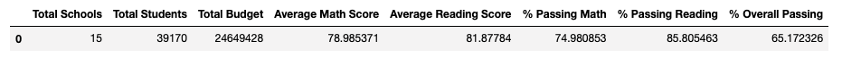
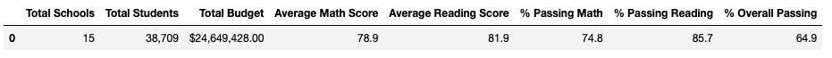

# School District Analysis

## Overview

This analysis uses standardized test data to understand performance trends and patterns in a school district. Two datasets were used, one containing data on each school and another containing data on all students in the district (datasets can be merged by school name). The analysis began with cleaning the data of incorrect student names. The following tables were then generated:

  - The district summary DataFrame
  - The school summary DataFrame
  - The top 5 performing schools, based on the overall passing rate
  - The bottom 5 performing schools, based on the overall passing rate
  - The average math score for each grade level from each school
  - The average reading score for each grade level from each school
  - The scores by school spending per student
  - The scores by school size
  - The scores by school type

Jupyter notebook and Python version 3.7 were used in the data sorting cleaning and analyzing processes. Code for this first set of deliverables can be found in *PyCitySchools.ipynb* of this repository. 

After this initial analysis, it was revealed that standardized math and reading test scores for 9th graders at Thomas High School were not valid. This means that the initial set of tables generated were not valid. In a new Jupyter script, *PyCitySchools_Challenge.ipynb*, the reading and math test scores for this set of students were replaced with NA values. The entire dataset was then reanalyzed to account for this reduction in total student count (the same set of tables was produced). 

## Results

District Summary, includes 9th Grade Thomas students:

District Summary, excludes 9th Grade Thomas students:

